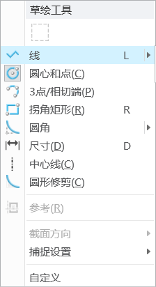

## 目录

- [目录](#目录)
- [认识creo](#认识creo)
  - [creo简介](#creo简介)
    - [1. Creo 历史简介](#1-creo-历史简介)
    - [2. 特点](#2-特点)
    - [3. 常用模块及其文件类型](#3-常用模块及其文件类型)
  - [界面](#界面)
  - [自定义快速访问工具栏](#自定义快速访问工具栏)
  - [设置工作目录](#设置工作目录)
  - [文件的新建，打开，保存](#文件的新建打开保存)
    - [参数化概念](#参数化概念)
    - [父项 / 子项](#父项--子项)
    - [双向关联性](#双向关联性)
    - [常用的文件扩展名](#常用的文件扩展名)
    - [新建(ctrl + n)](#新建ctrl--n)
    - [打开(ctrl + o) + 保存(ctrl + s)](#打开ctrl--o--保存ctrl--s)
    - [基础操作](#基础操作)
  - [个性化背景](#个性化背景)
  - [补充鼠标滚轮缩放的更改](#补充鼠标滚轮缩放的更改)
  - [图形工具栏部分功能](#图形工具栏部分功能)
    - [调整](#调整)
    - [显示样式](#显示样式)
    - [视图方向](#视图方向)
      - [重定向](#重定向)
    - [基准和旋转中心的显示](#基准和旋转中心的显示)
  - [管理文件与会话](#管理文件与会话)
    - [管理文件](#管理文件)
    - [管理会话](#管理会话)
  - [选项卡的小设置](#选项卡的小设置)
- [草绘模块](#草绘模块)
  - [图元](#图元)
  - [直线](#直线)
    - [线链](#线链)
    - [直线相切](#直线相切)
    - [直线的标注](#直线的标注)
  - [鼠标快捷键及鼠键组合在草绘中的应用](#鼠标快捷键及鼠键组合在草绘中的应用)
    - [应用](#应用)
    - [快捷菜单(类似鼠标笔势)](#快捷菜单类似鼠标笔势)

## 认识creo

### creo简介

#### 1. Creo 历史简介

1985 年，PTC 公司开始参数化的建模软件开发，1988 年，PROE 第一版问世；经过多年的发展，PROE 已成为世界上最流行的计算机辅助设计与制造软件（CAD\CAM）之一

Creo（PRO/E）是美国 PTC 公司于 2010 年 10 月推出 CAD 设计软件包。Creo 是整合了 PTC 公司的三个软件 Pro/Engineer 的参数化技术、CoCreate 的直接建模技术和 ProductView 的三维可视化技术的新型 CAD 设计软件包，是 PTC 公司闪电计划所推出的第一个产品。其最新版本为 creo9

#### 2. 特点

**3D 实体建模**：实体模型有体积和曲面面积；能直接从创建的几何计算质量属性；处理实体模型时模型自身仍是一个实体。

**基于特征设计**：以自然的思考方式设计，让设计者感到亲切；以特征为设计单位，可随时对特征进行调整、插入、删除、重新定义等修改工作。

**单一数据库**：可随时由 3D 实体模型生成 2D 工程图并自动标注尺寸；在 3D 或 2D 图形上修改尺寸时，相关的 2D 图形、3D 实体模型以及装配、制造等相关设计均会自动修改。

**参数化设计**：用灵活可变的参数表示设计要求、原则、方法和结果，设计过程中可随时更改；能运用数学运算功能建立各尺寸参数间的关系式，使模型自动计算出应有的外形，保证零件准确的相对关系。

#### 3. 常用模块及其文件类型

### 界面

### 自定义快速访问工具栏

点击小三角选择更多命令进入

想要的命令移动到右边，不想要的时候移动回左边就好了

### 设置工作目录

creo中要指定一个工作目录，作为你工作的地点，用与文件的打开，新建，保存等(不指定默认c盘C:\Users\Public\Documents\中)

打开软件，可以通过两种方式设置工作目录，在软件中设置的工作目录都是临时的，只在当前窗口有用，关掉就没有了

正确的设置方法，右键自己桌面上的creo启动图标，点击属性，将自己想要设置的起始工作目录填入框框

### 文件的新建，打开，保存

#### 参数化概念

Creo模型使用数字和约束来定义模型中特征的尺寸和位置。如果修改某特征尺寸的值，则该特征会相应地进行更新，此更改会自动影响到模型中相关的特征，直至影响整个零件。

#### 父项 / 子项

Creo在创建新特征时，任何在创建过程中参考的特征都成为新特征的父项，如果父项被更新，则父项的任何子项也会相应地更新，这个关系称为父子关系。

#### 双向关联性

指在 Creo的任何模式下，对某个模型所做的更改将会自动反映在所有的模式中。比如，在零件中对模型所做的更改，会反映在使用该模型的每个装配体中，同时这种更改也会反映在该模型的工程图中。

#### 常用的文件扩展名

Creo主要有几种常用的文件类型，分别对应着零件、组件、工程图、草绘、格式文件。

1.prt - 此扩展名表示零件对象。
2.asm - 此扩展名表示组件对象。
3.drw - 此扩展名表示工程图。
4.Sec - 此扩展名表示二维草绘。
5.frm - 此扩展名表示图框格式。

#### 新建(ctrl + n)

进入软件选择新建，也可以点击文件然后选择新建

要取消默认的模版，默认是英制**我们使用的是公制**

点击确定后会弹出选择模版的选项，我们一般选择mmns_part_solid_abs和mmns_part_solid_rel

in开头的文件名称模板都是**英制的模板。**
mm开头的文件名称模板都是**公制的模板。**

abs后缀名的是**绝对精度（absolute）**
rel后缀名的是**相对精度（relative）**

**1. 绝对精度**
**定义**：模型的绝对精度是 Creo 能够无错误显示或解释单位大小的最小容许值。
**示例**：若模型绝对精度设为 0.01，Creo 可准确显示长度≥0.01 的边，但可能无法显示长度＜0.01 的边。

**2. 相对精度**
**定义**：指定最小模型尺寸与零件尺寸的比率，即通过一个比例值设置模型中的最小尺寸，默认比例值为 0.0012。
**示例**：若模型零件尺寸为 100mm，结合默认相对精度 0.0012，Creo 可准确显示长度≥0.12mm（100mm×0.0012）的边，但可能无法显示长度＜0.12mm 的边。

**1. 精度计算公式**
绝对精度 = 相对精度 × 零件尺寸（模型最大边界尺寸）

#### 打开(ctrl + o) + 保存(ctrl + s)

可以在文件选项下进行，也可以直接点击快速访问工具栏上的

#### 基础操作

**移动模型**      shift + 鼠标中键
**旋转**          鼠标中键
**放大缩小**      鼠标滚轮

### 个性化背景

来到系统外观界面，找不到的可以直接右上角放大镜搜索一下

在系统外观一栏，点击系统颜色可以选择系统的一些默认的颜色方案，也可以进行自定义，配置好后可以点击导出，保存文件夹里

要导入的使用的时候来到**系统颜色**右边的导入，导入别人给你的方案或者自己的方案，但是这个只是临时的配置，关掉creo后重新打开仍然要重新来一遍

配置完后应该打开图片左下角**导出配置**，会来到软件目录下，将导出的config.pro覆盖保存在这里就可以了，这就是永久性的修改，其他的软件配置也是同理

### 补充鼠标滚轮缩放的更改

由于creo鼠标滚轮缩放和其它软件的缩放是相反的，用的不习惯可以修改一下

设置完成别忘记了导出配置将配置文件再次保存到软件目录

### 图形工具栏部分功能

#### 调整

第一个是**重新调整功能**，若图像在角落，可以点击**重新调整功能**快速使视图回到中心

后面分别是**放大缩小**，选择后可以框选一个区域放大或者缩小进行观察(个人觉得鼠标更好使)

#### 显示样式

**带反射着色**      
模型更为真实有倒影

**带边着色**        
边线会加深，模型线条更清晰

**着色**            
正常的显示

**消隐**            
模型变成线条模式，只能看见该视角下可见的线条

**隐藏线**
模型内部线条可见，软件用浅色线条

**线框**
内部和外部线条全部可见

#### 视图方向

里面的视图对应着各个基准面，点击可以快速跳转

##### 重定向

选择自己想要的视图视角，命名并且将其进行保存，之后可以选择直接跳转到该方向

#### 基准和旋转中心的显示

### 管理文件与会话

#### 管理文件

**重命名**

在重名名时如果有相关联的**工程图和装配图**要记得一起打开，这样重命名的时候就可以在所有文件中同时进行更改，否则下次打开关联文件的时候会报错

**删除旧版本**

creo在保存文件的时候不是在原文件上进行覆盖保存，而是会保**存一个新的版本**

**例如原文件**    模型.prt.1
**保存后**        模型.prt.1 + 模型.prt.2

删除旧版本就是用来进行删除之前的版本，保留下最新的版本

同理**删除所有版本**就是字面意思了，但是要慎重，确保该文件没有用的时候再进行删除

#### 管理会话

**会话的含义**

creo是基于内存的软件，它创建和编辑文件都是在系统的内存中进行的，当我们编辑的文件对象位于系统的内存时，就称为在会话中

**拭除当前**

当你关闭当前的窗口时，文件并没有真正的被关闭，而是保留在系统的内存中，在主页中点击**文件夹浏览器下的当前会话**可以看见

这时想要彻底关闭不需要的窗口就可以选择**拭除当前**的命令

同理**拭除未显示的**就是移除当前窗口外的所有窗口

### 选项卡的小设置

**着色模型显示设置**

设置 --> 外观.模型显示 -->  着色模型显示设置

着色品质可以10左右，在绘制圆柱或者圆的时候，**着色品质数值越高边界越光滑**

**启动关闭浏览器设置**

设置 --> 窗口设置 -->  取消启动时展开浏览器

**别忘了导出配置文件并且保存**

## 草绘模块

新建 --> 选择草绘

### 图元

在Creo软件中，图元是指用于构建和设计模型的基本几何元素，**包括点、线、面和体**等。

**图元的定义**
在Creo中，图元（Entities）是构成三维模型的基本元素。它们可以是几何形状（如**线段、曲线、面、体**）或其他设计元素（如约束、标注等）。图元在设计过程中起着至关重要的作用，因为它们是创建和修改模型的基础。

**图元的类型**
**几何图元**：包括点、线、面和体等基本形状。
**约束图元**：用于定义图形之间的关系和限制，例如平行、垂直等。
**标注图元**：用于在图形上添加尺寸和注释，以便于理解和修改设计。

### 直线

#### 线链

按下**线链**命令，在图上点击，两点确定一条直线，按**ESC**或者**鼠标中键**可以取消下一条直线的绘制(但是还是在直线的命令下，鼠标上会有一个十字的符号)，再次按一次**ESC**或者**鼠标中键**可以退出命令回到**选择模式**

#### 直线相切

选择该命令，可以创建两个图元之间的切线，圆或者圆弧等

#### 直线的标注

**强弱尺寸**

弱尺寸是**系统自动生成**的尺寸，通常小数点后有很多位，可能会随着图形的修改而变化。强尺寸是**用户自定义**的尺寸，经过强化后保持不变，确保设计的严格性。选中弱尺寸后，可以通过右键选择“强”命令将其转换为强尺寸，修改后的尺寸即为强尺寸。 这样，强尺寸在设计中提供了更高的稳定性和控制。

直接双击直线上的标注就可以进行修改尺寸，**弱尺寸修改后变成强尺寸**，颜色变深

也可以使用尺寸命令进行标注，选择该命令，先单击选中直线，然后在空白处使用中键就可以进行标注，也可以分别选中直线的两个端点进行标注

### 鼠标快捷键及鼠键组合在草绘中的应用

#### 应用

**左键**
**1、单击**：绘制图元（直线 / 圆 / 样条等）、选取图元（尺寸 / 约束）Ctrl + 左键单击，对多个图元选择。
**2、双击**：修改尺寸。
**3、按住**：拖动尺寸、拖动图元、框选图元、多选图元(删除段命令)

**中键**
**1、单击**：中止画图、返回选择、确认（回车键）、标注尺寸。
**2、按住**：移动屏幕（所有图元）。
**3、Ctrl + 中键按住**：缩放视图（前移缩小，后移放大）。
**4、滚轮**：快速缩放

**右键**
**1、单击**：草绘时切换活动约束（启用 / 锁定 / 禁用）
**2、按住**：弹出对应菜单栏

#### 快捷菜单(类似鼠标笔势)

和sw类似，长按鼠标右键呼出，点击自定义，可以配置自己想要的命令，想要的命令拖至草绘工具中就好了，这样画图比较快

