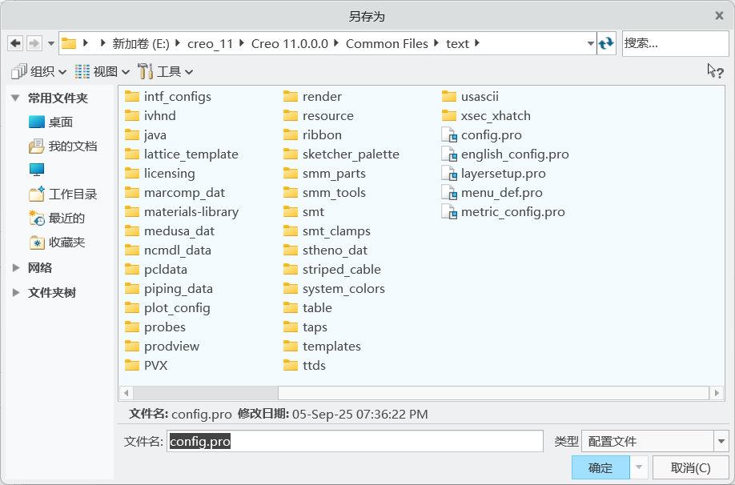
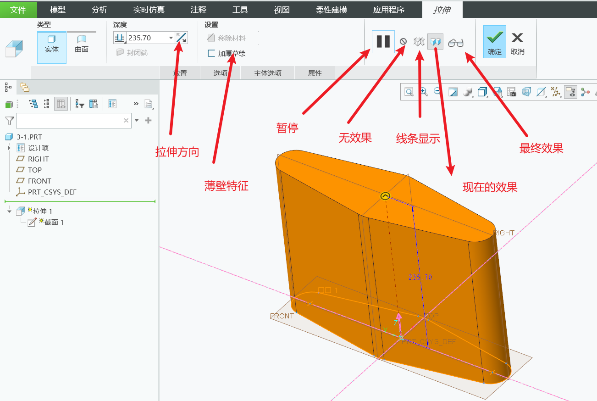

## 目录

- [目录](#目录)
- [认识creo](#认识creo)
  - [creo简介](#creo简介)
    - [1. Creo 历史简介](#1-creo-历史简介)
    - [2. 特点](#2-特点)
    - [3. 常用模块及其文件类型](#3-常用模块及其文件类型)
  - [界面](#界面)
  - [自定义快速访问工具栏](#自定义快速访问工具栏)
  - [设置工作目录](#设置工作目录)
  - [文件的新建，打开，保存](#文件的新建打开保存)
    - [参数化概念](#参数化概念)
    - [父项 / 子项](#父项--子项)
    - [双向关联性](#双向关联性)
    - [常用的文件扩展名](#常用的文件扩展名)
    - [新建(ctrl + n)](#新建ctrl--n)
    - [打开(ctrl + o) + 保存(ctrl + s)](#打开ctrl--o--保存ctrl--s)
    - [基础操作](#基础操作)
  - [个性化背景](#个性化背景)
  - [补充鼠标滚轮缩放的更改](#补充鼠标滚轮缩放的更改)
  - [图形工具栏部分功能](#图形工具栏部分功能)
    - [调整](#调整)
    - [显示样式](#显示样式)
    - [视图方向](#视图方向)
      - [重定向](#重定向)
    - [基准和旋转中心的显示](#基准和旋转中心的显示)
  - [管理文件与会话](#管理文件与会话)
    - [管理文件](#管理文件)
    - [管理会话](#管理会话)
  - [选项卡的小设置](#选项卡的小设置)
- [草绘模块](#草绘模块)
  - [图元](#图元)
  - [直线](#直线)
    - [线链](#线链)
    - [直线相切](#直线相切)
    - [直线的标注](#直线的标注)
  - [鼠标快捷键及鼠键组合在草绘中的应用](#鼠标快捷键及鼠键组合在草绘中的应用)
    - [应用](#应用)
    - [快捷菜单(类似鼠标笔势)](#快捷菜单类似鼠标笔势)
  - [圆和矩形的标注](#圆和矩形的标注)
  - [圆弧](#圆弧)
  - [样条曲线](#样条曲线)
  - [构造模式](#构造模式)
  - [镜像](#镜像)
  - [自动捕捉约束](#自动捕捉约束)
  - [调整图元的大小，位置，角度](#调整图元的大小位置角度)
  - [删除段，拐角，分割](#删除段拐角分割)
  - [导入图元](#导入图元)
  - [选项板](#选项板)
  - [自定义选项板](#自定义选项板)
  - [图元的偏移和加厚](#图元的偏移和加厚)
    - [偏移](#偏移)
    - [加厚](#加厚)
  - [基线和周长](#基线和周长)
  - [批量修改尺寸](#批量修改尺寸)
  - [草绘的几何检查](#草绘的几何检查)
- [实体建模](#实体建模)
  - [拉伸](#拉伸)
    - [拉伸实体](#拉伸实体)
    - [拉伸切除](#拉伸切除)
  - [拉伸深度类型](#拉伸深度类型)
  - [关于默认模版的问题](#关于默认模版的问题)
  - [拔模](#拔模)
  - [拉伸建模技巧](#拉伸建模技巧)
    - [选择部分草绘区域](#选择部分草绘区域)
    - [继承父项特征](#继承父项特征)
  - [旋转特征的建立](#旋转特征的建立)
  - [对称尺寸的标注](#对称尺寸的标注)
  - [创建基准](#创建基准)
    - [基准轴](#基准轴)
    - [基准面](#基准面)
    - [基准点](#基准点)
    - [基准轴](#基准轴-1)
  - [圆角(倒角同理)](#圆角倒角同理)
    - [一般倒圆角](#一般倒圆角)
    - [完全倒圆角](#完全倒圆角)
    - [可变倒圆角](#可变倒圆角)
    - [参考倒圆角](#参考倒圆角)
    - [终止与参考圆角](#终止与参考圆角)
    - [过渡模式](#过渡模式)
    - [自动倒圆角](#自动倒圆角)
  - [孔的添加](#孔的添加)
    - [放置类型](#放置类型)
  - [拔模](#拔模-1)
    - [分割](#分割)
    - [延伸相交曲面](#延伸相交曲面)
  - [抽壳](#抽壳)
  - [筋](#筋)
    - [轨迹筋](#轨迹筋)
    - [轮廓筋](#轮廓筋)
  - [扫描](#扫描)

## 认识creo

### creo简介

#### 1. Creo 历史简介

1985 年，PTC 公司开始参数化的建模软件开发，1988 年，PROE 第一版问世；经过多年的发展，PROE 已成为世界上最流行的计算机辅助设计与制造软件（CAD\CAM）之一

Creo（PRO/E）是美国 PTC 公司于 2010 年 10 月推出 CAD 设计软件包。Creo 是整合了 PTC 公司的三个软件 Pro/Engineer 的参数化技术、CoCreate 的直接建模技术和 ProductView 的三维可视化技术的新型 CAD 设计软件包，是 PTC 公司闪电计划所推出的第一个产品。其最新版本为 creo9

#### 2. 特点

**3D 实体建模**：实体模型有体积和曲面面积；能直接从创建的几何计算质量属性；处理实体模型时模型自身仍是一个实体。

**基于特征设计**：以自然的思考方式设计，让设计者感到亲切；以特征为设计单位，可随时对特征进行调整、插入、删除、重新定义等修改工作。

**单一数据库**：可随时由 3D 实体模型生成 2D 工程图并自动标注尺寸；在 3D 或 2D 图形上修改尺寸时，相关的 2D 图形、3D 实体模型以及装配、制造等相关设计均会自动修改。

**参数化设计**：用灵活可变的参数表示设计要求、原则、方法和结果，设计过程中可随时更改；能运用数学运算功能建立各尺寸参数间的关系式，使模型自动计算出应有的外形，保证零件准确的相对关系。

#### 3. 常用模块及其文件类型

### 界面

### 自定义快速访问工具栏

点击小三角选择更多命令进入

想要的命令移动到右边，不想要的时候移动回左边就好了

### 设置工作目录

creo中要指定一个工作目录，作为你工作的地点，用与文件的打开，新建，保存等(不指定默认c盘C:\Users\Public\Documents\中)

打开软件，可以通过两种方式设置工作目录，在软件中设置的工作目录都是临时的，只在当前窗口有用，关掉就没有了

正确的设置方法，右键自己桌面上的creo启动图标，点击属性，将自己想要设置的起始工作目录填入框框

### 文件的新建，打开，保存

#### 参数化概念

Creo模型使用数字和约束来定义模型中特征的尺寸和位置。如果修改某特征尺寸的值，则该特征会相应地进行更新，此更改会自动影响到模型中相关的特征，直至影响整个零件。

#### 父项 / 子项

Creo在创建新特征时，任何在创建过程中参考的特征都成为新特征的父项，如果父项被更新，则父项的任何子项也会相应地更新，这个关系称为父子关系。

#### 双向关联性

指在 Creo的任何模式下，对某个模型所做的更改将会自动反映在所有的模式中。比如，在零件中对模型所做的更改，会反映在使用该模型的每个装配体中，同时这种更改也会反映在该模型的工程图中。

#### 常用的文件扩展名

Creo主要有几种常用的文件类型，分别对应着零件、组件、工程图、草绘、格式文件。

1.prt - 此扩展名表示零件对象。
2.asm - 此扩展名表示组件对象。
3.drw - 此扩展名表示工程图。
4.Sec - 此扩展名表示二维草绘。
5.frm - 此扩展名表示图框格式。

#### 新建(ctrl + n)

进入软件选择新建，也可以点击文件然后选择新建

要取消默认的模版，默认是英制**我们使用的是公制**

点击确定后会弹出选择模版的选项，我们一般选择mmns_part_solid_abs和mmns_part_solid_rel

in开头的文件名称模板都是**英制的模板。**
mm开头的文件名称模板都是**公制的模板。**

abs后缀名的是**绝对精度（absolute）**
rel后缀名的是**相对精度（relative）**

**1. 绝对精度**
**定义**：模型的绝对精度是 Creo 能够无错误显示或解释单位大小的最小容许值。
**示例**：若模型绝对精度设为 0.01，Creo 可准确显示长度≥0.01 的边，但可能无法显示长度＜0.01 的边。

**2. 相对精度**
**定义**：指定最小模型尺寸与零件尺寸的比率，即通过一个比例值设置模型中的最小尺寸，默认比例值为 0.0012。
**示例**：若模型零件尺寸为 100mm，结合默认相对精度 0.0012，Creo 可准确显示长度≥0.12mm（100mm×0.0012）的边，但可能无法显示长度＜0.12mm 的边。

**1. 精度计算公式**
绝对精度 = 相对精度 × 零件尺寸（模型最大边界尺寸）

#### 打开(ctrl + o) + 保存(ctrl + s)

可以在文件选项下进行，也可以直接点击快速访问工具栏上的

#### 基础操作

**移动模型**      shift + 鼠标中键
**旋转**          鼠标中键
**放大缩小**      鼠标滚轮

### 个性化背景

来到系统外观界面，找不到的可以直接右上角放大镜搜索一下

在系统外观一栏，点击系统颜色可以选择系统的一些默认的颜色方案，也可以进行自定义，配置好后可以点击导出，保存文件夹里

要导入的使用的时候来到**系统颜色**右边的导入，导入别人给你的方案或者自己的方案，但是这个只是临时的配置，关掉creo后重新打开仍然要重新来一遍

配置完后应该打开图片左下角**导出配置**，会来到软件目录下，将导出的config.pro覆盖保存在这里就可以了，这就是永久性的修改，其他的软件配置也是同理

### 补充鼠标滚轮缩放的更改

由于creo鼠标滚轮缩放和其它软件的缩放是相反的，用的不习惯可以修改一下

设置完成别忘记了导出配置将配置文件再次保存到软件目录

### 图形工具栏部分功能

#### 调整

第一个是**重新调整功能**，若图像在角落，可以点击**重新调整功能**快速使视图回到中心

后面分别是**放大缩小**，选择后可以框选一个区域放大或者缩小进行观察(个人觉得鼠标更好使)

#### 显示样式

**带反射着色**      
模型更为真实有倒影

**带边着色**        
边线会加深，模型线条更清晰

**着色**            
正常的显示

**消隐**            
模型变成线条模式，只能看见该视角下可见的线条

**隐藏线**
模型内部线条可见，外部用浅色线条

**线框**
内部和外部线条全部可见

#### 视图方向

里面的视图对应着各个基准面，点击可以快速跳转

##### 重定向

选择自己想要的视图视角，命名并且将其进行保存，之后可以选择直接跳转到该方向

#### 基准和旋转中心的显示

### 管理文件与会话

#### 管理文件

**重命名**

在重名名时如果有相关联的**工程图和装配图**要记得一起打开，这样重命名的时候就可以在所有文件中同时进行更改，否则下次打开关联文件的时候会报错

**删除旧版本**

creo在保存文件的时候不是在原文件上进行覆盖保存，而是会保**存一个新的版本**

**例如原文件**    模型.prt.1
**保存后**        模型.prt.1 + 模型.prt.2

删除旧版本就是用来进行删除之前的版本，保留下最新的版本

同理**删除所有版本**就是字面意思了，但是要慎重，确保该文件没有用的时候再进行删除

#### 管理会话

**会话的含义**

creo是基于内存的软件，它创建和编辑文件都是在系统的内存中进行的，当我们编辑的文件对象位于系统的内存时，就称为在会话中

**拭除当前**

当你关闭当前的窗口时，文件并没有真正的被关闭，而是保留在系统的内存中，在主页中点击**文件夹浏览器下的当前会话**可以看见

这时想要彻底关闭不需要的窗口就可以选择**拭除当前**的命令

同理**拭除未显示的**就是移除当前窗口外的所有窗口

### 选项卡的小设置

**着色模型显示设置**

设置 --> 外观.模型显示 -->  着色模型显示设置

着色品质可以10左右，在绘制圆柱或者圆的时候，**着色品质数值越高边界越光滑**

**启动关闭浏览器设置**

设置 --> 窗口设置 -->  取消启动时展开浏览器

**别忘了导出配置文件并且保存**

## 草绘模块

新建 --> 选择草绘

### 图元

在Creo软件中，图元是指用于构建和设计模型的基本几何元素，**包括点、线、面和体**等。

**图元的定义**
在Creo中，图元（Entities）是构成三维模型的基本元素。它们可以是几何形状（如**线段、曲线、面、体**）或其他设计元素（如约束、标注等）。图元在设计过程中起着至关重要的作用，因为它们是创建和修改模型的基础。

**图元的类型**
**几何图元**：包括点、线、面和体等基本形状。
**约束图元**：用于定义图形之间的关系和限制，例如平行、垂直等。
**标注图元**：用于在图形上添加尺寸和注释，以便于理解和修改设计。

### 直线

#### 线链

按下**线链**命令，在图上点击，两点确定一条直线，按**ESC**或者**鼠标中键**可以取消下一条直线的绘制(但是还是在直线的命令下，鼠标上会有一个十字的符号)，再次按一次**ESC**或者**鼠标中键**可以退出命令回到**选择模式**

#### 直线相切

选择该命令，可以创建两个图元之间的切线，圆或者圆弧等

#### 直线的标注

**强弱尺寸**

弱尺寸是**系统自动生成**的尺寸，通常小数点后有很多位，可能会随着图形的修改而变化。强尺寸是**用户自定义**的尺寸，经过强化后保持不变，确保设计的严格性。选中弱尺寸后，可以通过右键选择“强”命令将其转换为强尺寸，修改后的尺寸即为强尺寸。 这样，强尺寸在设计中提供了更高的稳定性和控制。

直接双击直线上的标注就可以进行修改尺寸，**弱尺寸修改后变成强尺寸**，颜色变深

也可以使用尺寸命令进行标注，选择该命令，先单击选中直线，然后在空白处使用中键就可以进行标注，也可以分别选中直线的两个端点进行标注

### 鼠标快捷键及鼠键组合在草绘中的应用

#### 应用

**左键**
**1、单击**：绘制图元（直线 / 圆 / 样条等）、选取图元（尺寸 / 约束）Ctrl + 左键单击，对多个图元选择。
**2、双击**：修改尺寸。
**3、按住**：拖动尺寸、拖动图元、框选图元、多选图元(删除段命令)

**中键**
**1、单击**：中止画图、返回选择、确认（回车键）、标注尺寸。
**2、按住**：移动屏幕（所有图元）。
**3、Ctrl + 中键按住**：缩放视图（前移缩小，后移放大）。
**4、滚轮**：快速缩放

**右键**
**1、单击**：草绘时切换活动约束（启用 / 锁定 / 禁用）
**2、按住**：弹出对应菜单栏

#### 快捷菜单(类似鼠标笔势)

和sw类似，长按鼠标右键呼出，点击自定义，可以配置自己想要的命令，想要的命令拖至草绘工具中就好了，这样画图比较快

### 圆和矩形的标注

**圆**
标注圆，点击两次圆的边线标注的是直径，点击一次再进行标注是半径

**矩形**

斜矩形

平行四边形

标注角度的时候要单击两条边后再按中键

### 圆弧

**圆锥曲线**

圆锥曲线是 creo 草绘中很有用的图元，它有很完美的曲率图，它不像样条线那样自由难以控制，也不像圆弧那样受限制。
Rho 就是**双曲线的高度**和其**起始点切线交点的高度**的**比值**。
Rho 在 0～1 之间。
椭圆：0.05 < Rho < 0.5
抛物线：Rho = 0.5
双曲线：0.5 < Rho < 0.95

**标注**

单击圆弧两次，用鼠标中键标注**直径**
单击圆弧一次，用鼠标中键标注**半径**
单击圆弧的两个端点，再单击圆弧一次，用鼠标中键标注**弧长**
 
 ### 样条曲线

标注点的斜率时，先点击样条曲线，后点击控制点，再点击参考线(图中水平和垂直的线)
 

### 构造模式

构造构造模式下绘制的虚线主要是**辅助和定位**的作用，**不参与三维特征的建立**，构造线和实体是可以相互转换的，选中整个实体或构造线并点击命令即可

### 镜像

框选想要镜像的图元，点击镜像命令后选择镜像轴即可完成

### 自动捕捉约束

有时候自动捕捉的约束会影响到画图，可以使用以下三种方法：

**1.继续移动鼠标，让约束符号消失**
**2.同时按下键盘的 SHIFT 键，退出活动约束**
**3.右键单击，切换活动约束状态**

### 调整图元的大小，位置，角度

框选住想要调整的图元，点击旋转调整大小。在这里面可以自己指定平移或旋转的参考点,旋转(逆时针为正)

### 删除段，拐角，分割

**删除段**
修剪多余或者不要的线条

**拐角**
将图元修剪(延伸)到其他图元，会形成一个拐角

**分割**
在线上分割出新的点，将线段进行分割

### 导入图元

选择该命令后可以在自己的文件夹中找到想要导入的文件，选择确定，
之后鼠标点击一下自己想要放置的位置，放置后可以调整大小，位置

### 选项板

这里面可以找到一些比较常用的形状，以及工作目录下的文件，可以直接拖动到图上进行导入

### 自定义选项板

有些图形我们经常要用到，比如公司的商标，特殊的标记、符号等，放入选项板中可以随时调用，就十分方便了。

**具体的操作步骤是：**
一、新建一个文件夹，名称与保存位置没有要求。
二、在选项中查找（添加）**sketcher_palette_path** 选项，值为新建文件夹的全路径，并导出配置文件。将自制的图形在草绘器中保存为 sec 文件(草绘文件)，将这些图形保存在自定义文件夹中即可。之后选项板中就可以看见该文件夹的文件

### 图元的偏移和加厚

#### 偏移

有三种的选择方式
**链选择**(起点终点之间的线)
**环选择**(选择所有相连的线)
**逐项选择**(一个一个的选)

在选择一条线(起点线段)的时候显示**逐项选择**，按住shift键，跳到另一条线上再次选择，这次选择的是终点线段，路径上的每一条线段都会被选上(**链选项**)，按鼠标右键可以切换路径，可以切换至**环选择**，就是全部选上

在确定之前记得输入偏移的数值，在图中，**正方向是软件默认指定的方向**(图中绿色的线条),想要反方向进行偏移，输入负的数值就好了

#### 加厚

就是在偏移的基础上对偏移后的线条处理，相当于偏移了两次

图中选择了一条边进行了处理，**选择加厚边**就是偏移的选项(偏移选择的方式)。

**端封闭**选项，开放如图就是不对开口进行处理，平整则是用直线连接开口，圆形就是用圆弧连接开口

选择好后会让您输入厚度，然后输入偏移距离(软件的箭头指示为正方向)

### 基线和周长

**周长** 

标注周长时，**选择图元的所有边**，按中键确定(不要将构造线也选上，只能选所要图元的边线)，而后选择一个尺寸作为变量

变量尺寸是不能主动修改的，这时你可以改变周长的值，变量尺寸会改变，其它尺寸不变

**基线**
如果有许多同一方向的尺寸，创建一条基线，在基线的基础上进行标注会更加清晰

### 批量修改尺寸

直接框选所有想要修改的尺寸，会弹出一个修改的窗口，在窗口中进行修改，被修改的尺寸会在图中显示

**建议关闭重新生成**，这个选项的作用是，每次修改完成后会重新生成图形，图形容易变形，当修改好所有尺寸的时候点击重新生成就好了

**注意**:最后重新生成图像的时候，**一是不能有多余或错误的约束**，否则尺寸修改会失败，**二是图元形状与样图相当**，否则也会失败，所以建议第一个尺寸标注正确的尺寸，定好图像大概的样子。

### 草绘的几何检查

**显示重叠**

例如两条线段重叠，软件会用其他颜色显示

**显示相交**

软件会突出交点

**显示连接**
图中连接这边的线条颜色比较深，设置不同的系统外观可以看的比较明显

**显示开放端**

**着色封闭环**

最后的三个命令，**选择交点命令**后选择两个图元可以判断是否有交点，选择**相切点命令**也是选择两个图元，选择图元命令则是**选择一个图元**(底下消息提示栏有提示)

## 实体建模

### 拉伸

#### 拉伸实体

拉伸特征是草绘截面沿着草绘平面的垂直方向拉伸而形成的三维几何体。创建拉伸的步骤如下：
1、设置工作目录
2、新建实体零件
3、更改文件名
4、取消默认模板
5、选择 **mmns_part_solid** 公制模板
6、选择功能区的拉伸命令，弹出拉伸操控板
7、选择拉伸类型
8、定义草绘平面和草绘方向
9、绘制截面草图
10、定义拉伸方向、深度类型及数值
11、预览和校验
12、完成拉伸特征的创建

在上方放置一栏，你可以修改草绘的方向，以及草绘的平面，软件中出现的小箭头是等一下你进行草绘的视角方向

#### 拉伸切除

点击拉伸命令，可以看见里面有一个切除材料就是拉伸切除，在没有实体的时候点击不了(没东西可以切除)，切除材料和拉伸实体的操作一样

**注意**：经常容易拉伸成曲面，拉伸成曲面会导致有些命令无法使用，**曲面实体是蓝色的**

### 拉伸深度类型

**可变**
自己指定拉伸长度，在草绘平面向一个方向拉伸

**对称**
自己指定拉伸长度，在草绘平面上对称拉伸

**到下一个**
拉伸至下一个曲面，草绘图必须在下一个曲面上具有完整投影

**穿透**
拉伸至与所有曲面相交

**穿至**
选定一个参考面，拉伸至该面相交

**到参考**
选定一个参考面，拉伸至该面相交，这个可以选择基准面,线，甚至一个点

**两侧同时拉伸**
可以在上方选项中点击，激活两个方向，可以分别定义两个方向上的拉伸方式

### 关于默认模版的问题

**一、什么是模板？为什么要取消默认模板？**

在 Creo 中有两种类型的模板：模型模板和绘图模板。拉伸建模中的模板属模型模板。

默认的模型模板是缺省的 Creo 模型，包括缺省的基准平面、命名的视图、缺省层、缺省参数以及缺省的单位。

默认模板在工作中并不常用，因为其绘图单位是英制的，国内的图纸一般都是 mm 的，所以我们要取消默认模板，选择选 **mmns_part_solid** 公制模板。

mmns_part_solid ，就是**长度单位为 mm**，**重量单位为 n**，**时间单位为 s **的零件实体。mmns 是毫米牛顿秒，是国内常用的公制单位。

默认的 inlbs_part_solid 模板，**长度单位是 in 英寸**，**重量单位是 lbs 磅**，都是英制单位。

**二、能否设置公制模板为默认模板？**

对软件熟练后，可以对配置文件重新定义，设置公制模板为默认模板。步骤如下：
1、文件 — 选项 — 配置编辑器 — 查找
2、输入 “template_solidpart” 把值设为 “mmns_part_solid“
3、导出配置，确定。

### 拔模

在拉伸命令的选项中，添加锥度，输入负数向反方向拔模

### 拉伸建模技巧

#### 选择部分草绘区域
在想要拉伸草绘的部分区域时，可以点击下方的过滤器，选择草绘区域，这样就可以选择部分想要的区域

#### 继承父项特征

从第一个草绘图是封闭图形，第二个是开放端，开放端拉伸出的实体会继承父项特征

可以利用这一个特性，利用父项的边界进行拉伸

### 旋转特征的建立

**步骤**

1. 定义旋转中心轴，绘制截面草图。
2. 定义旋转方向、角度类型、角度值。
3. 预览和校验。
4. 确定，完成旋转特征的创建。

**旋转特征对截面的要求**

1、旋转截面必须有一条旋转轴（几何中心线），草图只能绘制在旋转轴的单侧。
2、如草绘中的几何中心线多于一条，系统默认第一条几何中心线为旋转轴。
3、实体特征的截面必须是闭合的，且内部不能有相交的图元，但可以有多个闭合环。
4、曲面特征的截面可以是开放的，但不能有多于一个的开放环。

选项和拉伸差不多

放置选项下，点击内部CL可以更改中心轴

### 对称尺寸的标注

若使用的是草绘的中心线作为对称轴，软件自动生成的弱尺寸不是对称尺寸，要使用**基准下的中心线作为对称轴**

**手动标注**：依次点击，点 --> 中心线 --> 点 然后中键即可

### 创建基准

#### 基准轴

**创建基准轴基准轴的作用:**
1、作为中心线：如圆柱、孔及旋转特征的中心线。
2、制作基准平面：如两个轴或边。

**创建基准轴的操作方法：**
1、**一个直边或轴**：通过选定边创建基准轴。
2、**两个基准点或顶点**：通过每个基准点或顶点加以约束来创建基准轴。
3、**过圆柱**：选择一个圆柱面或圆锥面，以旋转曲面的中心轴创建基准轴。
4、**基准点和曲面**：通过该点创建平行或垂直于该曲面的基准轴。
5、**曲线或边以及其中的一个端点**：通过端点约束并相切于曲线来创建基准轴。
6、**两个非平行基准平面或平曲面**：通过相交线创建基准轴。

#### 基准面

**基准面的作用:**

1、尺寸标注的参考平面；
2、决定三维模型的方向；
3、作为草绘平面；
4、作为零件装配时的参考平面；
5、用以产生剖面。

**创建基准面的操作方法：**
1、**基准点或边的顶点**：基准平面穿过所选的点
2、**轴、边、二维曲线**： 基准平面穿过所选的线或与所选的线相互垂直
3、**垂直平面**：要创建的基准平面垂直于另一个平面
4、**平行平面**：要创建的基准平面平行于另一个平面
5、**与圆柱面相**切：要创建的基准平面相切于一个圆柱面
6、**角度平面**：要创建的基准平面与另一个平面成一定角度

#### 基准点

**基准点的作用:**
1、用来放置轴、基准平面、孔；
2、用来为网格生成加载点；
3、在绘图中连接基准目标和注释；
4、创建坐标系；
5、作为管道特征的轨迹点

**创建基准点的操作方法：**
1、草绘：在草绘环境，绘制一个基准点；
2、顶点：用零件实体、曲线的端点创建基准点；
3、中心点：在圆、椭圆、弧的中心处创建基准点；
4、曲线 / 边：在曲线或边上，用位置的参数值创建基准点。

#### 基准轴

**基准坐标系的作用：**
1、计算质量属性；
2、装配元件；
3、为有限元分析放置约束；
4、为刀具轨迹提供制造操作参照；
5、用于定位其他特征的参照，如基准面、基准轴等。

**创建坐标系的方法：**
选择三个平面，交点为坐标原点，第一个平面的法向定义第一个轴的方向，第二个平面的法向定义第二个轴的方向，系统用右手定则确定第三轴方向。

### 圆角(倒角同理)

#### 一般倒圆角

在进行倒圆角的时候，会创建一个**集**，同一个**集**中的圆角是一样的，按住ctrl进行多条边的倒圆角可以使圆角一样，想要创建不一样的圆角可以直接新建一个集(不按ctrl进行倒圆角会默认创建一个新的集)

#### 完全倒圆角
同时选择两条边，就可以选择进行完全倒圆角

#### 可变倒圆角
在箭头所指的方框中右键，可以**选择添加半径**，这样就可以控制不同位置的圆角大小了

可以修改每一个点的参考，若点的位置不好确定，可以先添加一个点，右键将要圆角的直线，后选择**位置参考**，可以快速确定点的位置

#### 参考倒圆角
在箭头所指改为参考，选取参考的顶点或者边线，就可以实现

#### 终止与参考圆角
选择要圆角的边线，选择过渡模式，过渡模式选择终止与参考，再选择要终止于的参考点

#### 过渡模式

在拐角倒圆角下选择过渡模式，选择圆角的相交部分，可以对圆角进行修改

#### 自动倒圆角

在选项一栏可以选择**创建倒圆角特征组**，因为正常使用完这个命令后，模型树中只有一个步骤，选择后，模型树中有倒圆角特征组的各个步骤，可以更加仔细的进行修改

### 孔的添加

简单的主要是创建孔洞，标准的用于创建螺纹孔

孔的放置一栏，**首先应该选择放置的曲面**进行放置

#### 放置类型

**线性**
可以按住ctrl选择一个或者多个参考，设置想要的定位尺寸，并对定位尺寸进行编辑

线性是选择两个参考曲面

**径向**
选择一个中心轴和平面，中心轴确定孔的原点到轴的半径，平面确定半径和平面的角度

**直径**
和径向类似，只不过这次中心轴确认的是直径

**同轴**
放置的时候选择一个放置平面和中心轴即可

**点上**
一个平面确定孔的方向，点确定孔的位置

### 拔模

选择一个拔模曲面作为目标曲面，**拔模枢轴为拔模的方向**(一般为面的法向方向)

#### 分割

在分割选项可以处理两端拔模的情况

分割选项用于分开拔模枢轴两侧的曲面

在侧选项中，**独立拔模侧面**：两侧的面同时进行拔模的编辑，可以设置两个不同角度的拔模
**从属拔模侧面**：两侧面相等角度拔模，对一侧进行编辑即可
**只拔模第一/第二侧**：只对一侧进行编辑，另一侧不改变

#### 延伸相交曲面

### 抽壳

将实体内部掏空，选择要移除的面，上方设置剩下的厚度，也可以自定义非默认厚度面

选项中可以激活排除的曲面，比如图中的圆柱不需要进行掏空

### 筋

#### 轨迹筋

**一、创建步骤**
1、选择草绘平面（筋的起始面）
2、绘制草绘作为筋的轨迹路径
3、定义筋的宽度与方向
4、定义筋的形状、添加拔模和圆角

**二、放置要点**
1、起始面可以是实体表面，也可以是基准面等其它平面
2、草绘（轨迹）可以是直线，也可以是曲线，
3、草绘可以是开放图元、相交线条、封闭图元，也可以是多个图元的组合
4、草绘的端点不需与边界重合，但是开放端必须能延伸到实体表面
5、筋的深度方向上必须全部是实体，可以到达多个曲面，但不能有孔洞

#### 轮廓筋

和轨迹筋有一点点的区别，但是只是先画好筋的轮廓，而后生成筋

### 扫描

**轨迹 + 截面 = 扫描**
在草绘截面沿轨迹进行扫描时，可以添加或移除材料。可以向草绘添加厚度。扫描几何表示可以是实体或曲面。

扫描工具的主要组成是轨迹。轨迹可以是曲线链或边链，**二维曲线、三维曲线、方程曲线、截面曲线、实体边线、曲面边线**都是可以的

轨迹不能与自身相交。相对于截面，弧或样条半径不能太小。

**草绘截面**
1、实体扫描草绘截面必须闭合
2、闭合环可以多于一个，但不能相连
3、开放环不能多于一个，不能自相交
4、相对于轨迹的拐角半径不能太大

