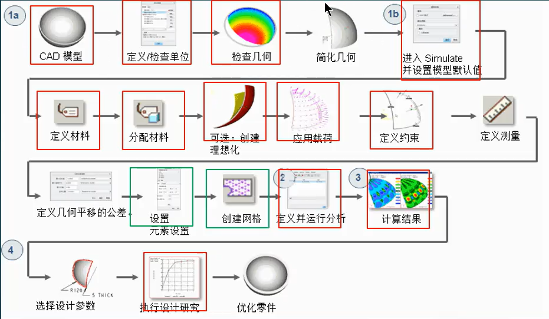
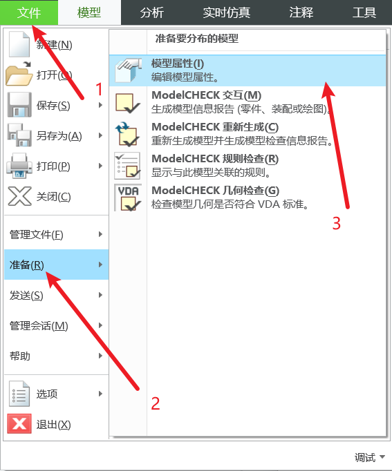

- [目录](#目录)
- [Creo Simulate能做什么](#creo-simulate能做什么)
  - [Creo Simulate基本操作](#creo-simulate基本操作)
    - [检查单位](#检查单位)
  - [有限元理论基础](#有限元理论基础)

## 目录

## Creo Simulate能做什么

### Creo Simulate基本操作 

#### 检查单位

上方**文件** ——> **准备** ——> **模型属性**,然后点击单位一栏的更改，进入**单位管理器**，一般更改为**毫米牛顿秒(mmNs)**

### 有限元理论基础